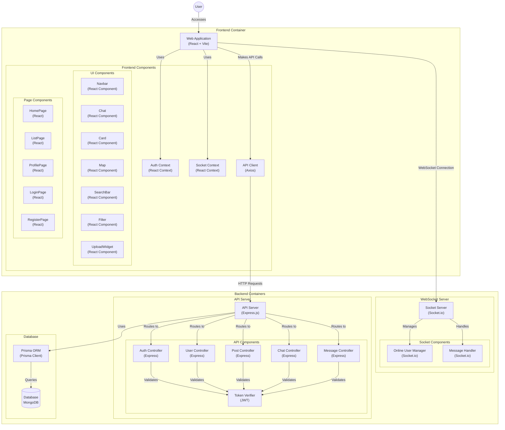

# 🏠 InstantEstate - Real Estate Web Application with Real-Time Chat

InstantEstate is a full-stack MERN (MongoDB, Express.js, React.js, Node.js) web application that allows users to list, explore, and communicate about real estate properties in real time. Built with scalability and user experience in mind, it features JWT-based authentication, real-time messaging using Socket.io, and a clean, responsive UI.

---

## 🚀 Features

- 🏡 Property Listings with filters and search
- 🔒 JWT Authentication & Authorization
- 💬 Real-Time Chat between buyers and sellers (Socket.io)
- 🗂️ Role-based routing with protected pages
- 🔄 React Router for seamless navigation
- 🧩 Modular backend using Express and Prisma
- 🌐 MongoDB for data storage
- 🎨 Responsive UI with SCSS and React Hooks
- 🧰 Clean codebase with reusable components and API routes

## 🛠️ Tech Stack
### Frontend
- React.js
- SCSS (SASS)
- React Router
- Axios
- Context API
### Backend
- Node.js
- Express.js
- MongoDB
- Prisma ORM
- Socket.io
- JSON Web Tokens (JWT)
- Bcrypt
---
# BLOCK DIAGRAM

 
